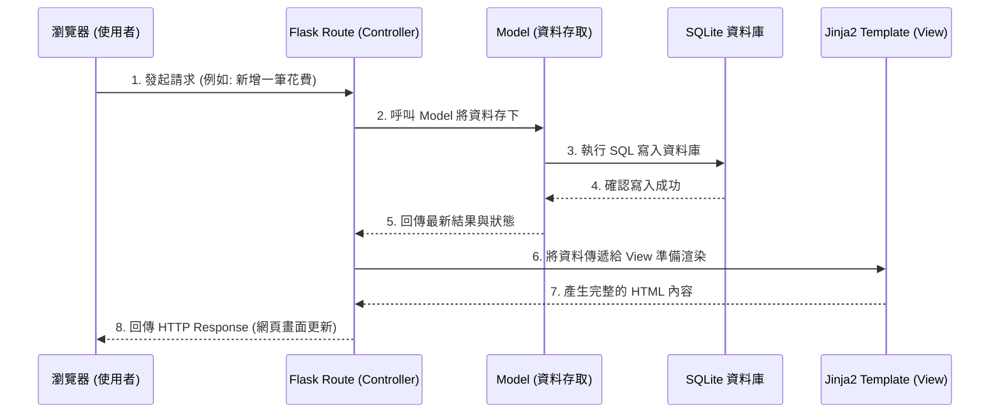

# 系統架構文件：簡易記帳系統

## 1. 技術架構說明

本專案採用經典的伺服器端渲染架構（Server-Side Rendering, SSR），並遵循 MVC（Model-View-Controller）設計模式。

**選用技術與原因：**
- **後端 (Python + Flask)**：Flask 是一個輕量級的 Python Web 框架，適合快速開發中小型專案，可依需求彈性擴展，沒有過多的冗餘配置。
- **模板引擎 (Jinja2)**：與 Flask 原生整合，負責動態渲染 HTML，將後端傳遞的資料轉換成使用者看得懂的網頁畫面。
- **資料庫 (SQLite)**：輕量級、無須額外安裝伺服器的資料庫，適合簡單的記帳系統。初期可搭配 sqlite3 或 SQLAlchemy 操作，方便測試與部署。
- **前端 (HTML/CSS/JS)**：搭配原生 Web 技術實作，必要時引入輕量級前端庫以達到直覺且流暢的操作體驗。

**Flask MVC 模式說明：**
- **Model（模型）**：負責與 SQLite 資料庫進行互動。它定義了資料庫的 Schema（如使用者、分類、明細、帳戶），並處裡存取資料的邏輯。
- **View（視圖）**：負責介面的呈現。在此架構中主要由 Jinja2 模板（`.html`）負責，從 Controller 接收資料並渲染為完整的 HTML 提供給瀏覽器。
- **Controller（控制器）**：由 Flask 的路由（Routes）負責，接收來自前端的 HTTP 請求，向 Model 查詢或更新資料，最後決定要渲染哪一個 View 畫面並將資料傳入。

## 2. 專案資料夾結構

以下為本專案的核心資料夾與檔案結構，以及各部分對應的職責：

```text
web_app_development/
├── app/                      # 專案主要程式碼目錄
│   ├── __init__.py           # Flask 應用程式初始化檔案
│   ├── models.py             # [Model] 定義資料庫模型（使用者、帳戶、收支明細等）
│   ├── routes.py             # [Controller] 集中處理所有 HTTP 請求的路由與商業邏輯
│   ├── templates/            # [View] 存放 Jinja2 HTML 模板檔
│   │   ├── base.html         # 共用樣板（包含共用 Head、導航列、頁尾）
│   │   ├── dashboard.html    # 儀表板頁面（消費視覺化圖表、帳戶餘額）
│   │   ├── transactions.html # 明細列表與快速記帳表單頁面
│   │   └── settings.html     # 基本設定（自定義分類、預算提醒設定）
│   └── static/               # 靜態資源（CSS、JS、圖片等）
│       ├── css/
│       │   └── style.css     # 全域樣式設定
│       └── js/
│           └── main.js       # 全域與共用前端互動邏輯（如表單驗證、圖表渲染）
├── instance/                 # 存放執行階段產生之檔案（不納入版本控制）
│   └── database.db           # SQLite 實體資料庫檔
├── docs/                     # 專案文件
│   ├── PRD.md                # 產品需求文件
│   └── ARCHITECTURE.md       # 系統架構文件（本文件）
├── requirements.txt          # Python 第三方套件依賴清單
└── app.py                    # 專案啟動入口，負責執行起 Flask Server
```

## 3. 元件關係圖

以下展示當使用者透過瀏覽器發送請求時，後端各個 MVC 元件的互動關係：



## 4. 關鍵設計決策

1. **傳統 SSR 不做前後分離**
   - **原因**：對於這個初期的簡易記帳專案來說，比起建置龐大的 React/Vue 專案加上純 API 後端，透過 Flask 內建的 Jinja2 能夠以最快的速度渲染出可用原型，並大幅降低開發複雜度與 API 維護成本。
2. **採用 SQLite 作為應用資料庫**
   - **原因**：無須繁雜的伺服器部署（如 MySQL），它的單一檔案特性完美契合 MVP 階段的迭代。如果未來系統成長需要轉移，只要修改 ORM 設定即可，不須大幅變更架構。
3. **資料庫層級的延遲與聚合運算**
   - **原因**：為了實現「前端圓餅圖分析」，後端 Model 將直接在資料庫層級進行 SQL 聚合計算（例如按分類 GROUP BY 加總），然後把結果經過 Route 送至前端，避免在 Python Route 裡做大量 For 迴圈運算，確保效能維持在 1 秒內載入。
4. **單一共用版型 (Base Template)**
   - **原因**：將頁首、頁尾、菜單集中至 `base.html`，讓記帳頁與儀表板頁等只需繼承自該版型（只替換主要區塊），不僅使頁面間的切換能保有視覺一致性，後續若要更改外觀也只要改一份。
