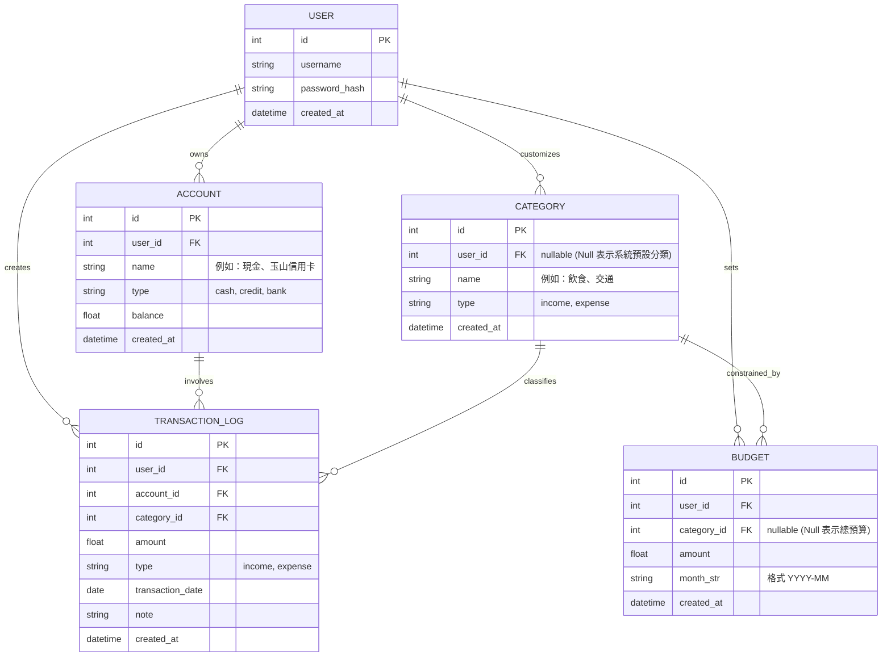

# 資料庫設計文件：簡易記帳系統

## 1. ER 圖（實體關係圖）

## 2. 資料表詳細說明

### 2.1 USER (使用者表)
紀錄使用者的登入資訊與帳號狀態。
- `id` (INTEGER): Primary Key，自動遞增。
- `username` (TEXT): 帳號名稱，必填且唯一。
- `password_hash` (TEXT): 經過 bcrypt 雜湊的密碼，必填。
- `created_at` (DATETIME): 建立時間。

### 2.2 ACCOUNT (帳戶表)
紀錄使用者的各種資金帳戶。
- `id` (INTEGER): PK。
- `user_id` (INTEGER): FK 對應至 `user.id`。
- `name` (TEXT): 帳戶名稱 (如「現金」、「國泰信用卡」)，必填。
- `type` (TEXT): 帳戶類型 (如 cash, credit, bank)，必填。
- `balance` (REAL): 此帳戶之目前餘額，預設 0.0。

### 2.3 CATEGORY (收支分類表)
紀錄分類項目，包含預設分類與使用者自訂。
- `id` (INTEGER): PK。
- `user_id` (INTEGER): FK，若為 NULL 表示系統預設全域可見的分類。
- `name` (TEXT): 分類名稱 (如「伙食費」)，必填。
- `type` (TEXT): 區分 `income` 或 `expense`，必填。

### 2.4 TRANSACTION_LOG (收支明細表)
紀錄每一筆記帳的流水帳。
- `id` (INTEGER): PK。
- `user_id` (INTEGER): FK 對應至 `user.id`。
- `account_id` (INTEGER): FK，此筆款項從哪扣或存入。
- `category_id` (INTEGER): FK，消費分類。
- `amount` (REAL): 金額，必填。
- `type` (TEXT): `income` 收入或 `expense` 支出。
- `transaction_date` (DATE): 消費發生日期。
- `note` (TEXT): 備註與說明，非必填。

### 2.5 BUDGET (預算表)
設定每個月份的預算。
- `id` (INTEGER): PK。
- `user_id` (INTEGER): FK。
- `category_id` (INTEGER): FK，若為 NULL 則代表設定該月的「總預算」。
- `amount` (REAL): 預算額度，必填。
- `month_str` (TEXT): 年月字串 (例如 `2026-04`)，必填以篩選單月份預算。

## 3. SQL 建表語法
完整的建表語法請參照 [database/schema.sql](file:///c:/Users/User/Desktop/D1376902/web_app_development/database/schema.sql)
Python Model 程式碼實作位於 [app/models/](file:///c:/Users/User/Desktop/D1376902/web_app_development/app/models/) 中。
