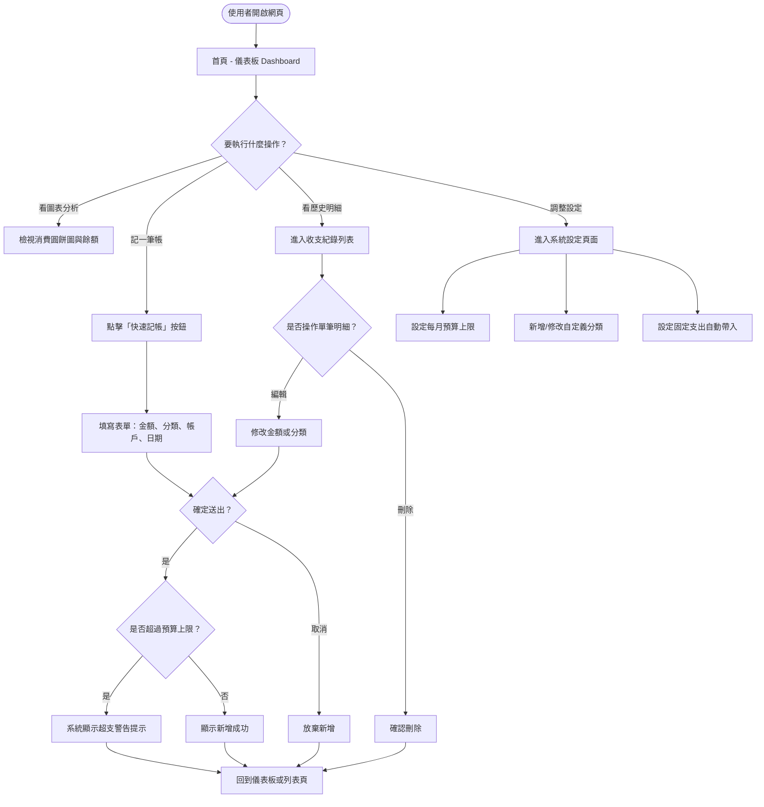
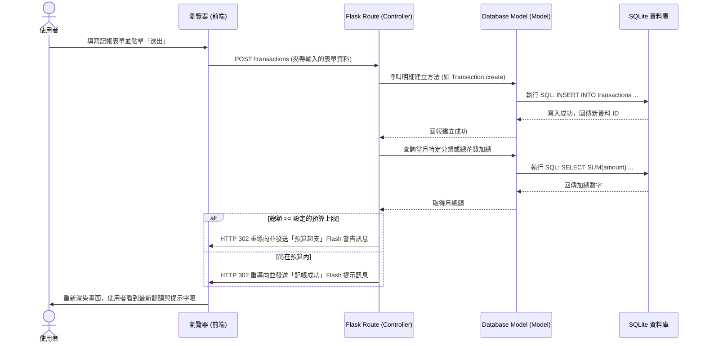

# 流程圖文件：簡易記帳系統

這份文件根據 PRD 需求與系統架構，將使用者的操作動線與系統資料流視覺化，以便團隊在開發前對整體流程有明確的共識。

---

## 1. 使用者流程圖 (User Flow)

此流程圖從使用者進入網站的首頁（儀表板）開始，涵蓋了查看圖表、新增記帳、以及進行相關設定的路徑。

---

## 2. 系統序列圖 (Sequence Diagram)

此序列圖展示了核心功能**「新增一筆記帳並檢查預算」**的系統底層運作流程，涵蓋了前端瀏覽器、後端 Flask 控制器以及 SQLite 資料庫的互動。

---

## 3. 功能清單對照表

下表列出系統主要功能所對應的入口 URL 路徑與 HTTP 方法，為接下來的 API/Routing 設計提供初步指引。

| 功能區塊 | 操作描述 | 建議的 URL 路徑 | HTTP 方法 |
| --- | --- | --- | --- |
| **首頁儀表板** | 顯示消費圖表、各帳戶餘額、預算進度 | `/` 或 `/dashboard` | GET |
| **收支明細** | 列表顯示歷史記帳資料 | `/transactions` | GET |
| **快速記帳** | 送出新增明細的表單 | `/transactions` | POST |
| **編輯明細** | 進入編輯明細表單畫面 | `/transactions/<id>/edit` | GET |
| **更新明細** | 送出更新後的明細資料 | `/transactions/<id>/edit` | POST |
| **刪除明細** | 將該明細從資料庫刪除 | `/transactions/<id>/delete` | POST |
| **系統設定** | 頁面呈現：管理預算、分類、固定開銷 | `/settings` | GET |
| **更新設定** | 儲存更改的設定項目 (新增分類等) | `/settings/update` | POST |
